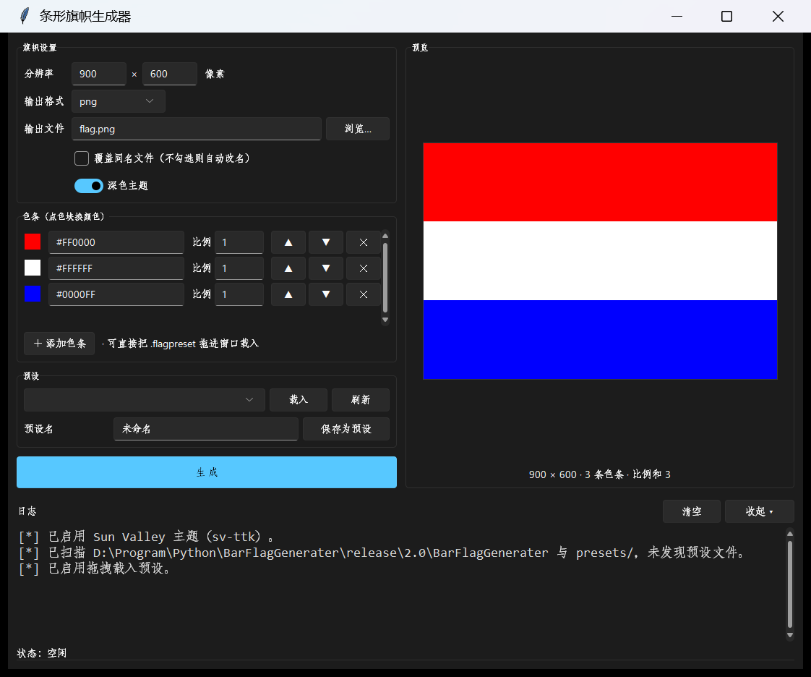

# 横条旗帜生成器 (BarFlagGenerator)

适用于由纯色横条组成的旗帜/图片。支持自定义分辨率、配色、色带宽度比例与输出格式（SVG / PNG / JPG），并能把配置保存成预设反复使用或分发给他人。

同时提供**图形界面**和**命令行**两套前端，功能完全一致。



---

## 目录

- [特性](#特性)
- [快速开始](#快速开始)
- [图形界面使用引导](#图形界面使用引导)
- [命令行使用引导](#命令行使用引导)
- [语法参考](#语法参考)
- [预设文件](#预设文件)
- [常见问题](#常见问题)
- [从源码构建 release](#从源码构建-release)
- [项目结构](#项目结构)
- [依赖](#依赖)
- [许可](#许可)

---

## 特性

- **两套前端，一套逻辑**：GUI 和 CLI 共享同一份业务代码，行为与日志措辞完全一致
- **所见即所得**：图形界面实时预览旗帜，改一个字符就重画
- **拖拽载入预设**：把 `.flagpreset` 直接拖进窗口即可套用
- **预设系统**：预设是纯文本，可以用记事本手写、可以版本管理
- **零依赖出图**：SVG 输出纯手写文本，连 Pillow 都不需要
- **缺什么自动装什么**：源码运行时 Pillow / sv-ttk / tkinterdnd2 缺失会自动 pip 安装，进度直接显示在界面日志和状态栏上
- **纯逻辑层与界面完全解耦**：`core` / `render` / `presets` / `deps` 里根本 import 不到 tkinter

---

## 快速开始

### 方式一：绿色版 exe（无需 Python 环境）

1. 到 [Releases](../../releases) 下载 `BarFlagGenerator-<版本号>-win64.zip`
2. 解压到**任意可写目录**（如 `C:\Program Files` 无法进行写操作，写入预设将失败。同时 Windows 不允许程序在管理员权限下接收拖拽操作。）
3. 双击 `BarFlagGenerator.exe`

首次运行 Windows 可能弹 SmartScreen 警告（因为 exe 没有代码签名），点「更多信息」→「仍要运行」即可。

### 方式二：从源码运行

需要 Python 3.9 或更高版本（开发和实测环境为 3.14.7）。

```bash
git clone <仓库地址>
cd BarFlagGenerator
python BarFlagGenerator.py
```

**不需要特意手动装依赖。** 首次运行缺少依赖会自动 `pip install`，安装进度会显示在日志区和状态栏上。也可以提前装好：

```bash
pip install pillow sv-ttk tkinterdnd2
```

> `tkinter` 是 Python 标准库，pip 上没有真正的同名包，所以它只能检测、不能自动安装。
> 用 python.org 或 Python Install Manager 装的完整版 Python 都自带；用 `--cli` 也可以完全不用图形界面。

---

## 图形界面使用引导

### 运行方式

| 场景 | 命令 |
| --- | --- |
| 不带任何参数 | `python BarFlagGenerator.py` → 图形界面 |
| 强制图形界面 | `python BarFlagGenerator.py --gui` |
| 打包后的 exe | 直接双击 `BarFlagGenerator.exe` |

### 界面分区

界面分三块：**左边表单**、**右边预览**、**底部日志 + 状态栏**。

#### 1. 旗帜设置

| 控件 | 说明 |
| --- | --- |
| **分辨率** | 两个输入框，宽 × 高，单位像素。必须是正整数 |
| **输出格式** | `svg` / `png` / `jpg` 三选一。改格式时输出文件的扩展名会自动跟着改 |
| **输出文件** | 输出路径。点「浏览…」选位置；也可以直接手打路径 |
| **覆盖同名文件** | **勾选** = 直接覆盖；**不勾选** = 自动改成 `flag(1).png` 这类不冲突的名字 |
| **深色主题** | 深色 / 浅色切换（需要 `sv-ttk`；没装时这个开关是灰的） |

#### 2. 色带

这是核心编辑区。每一行是一条色带：

- **左侧色块** —— 点一下弹出取色器，所见即所得地改颜色
- **十六进制框** —— 也可以直接手打，如 `#FF0000` 或 `FF0000`；打错了色块会变成红框提示
- **比例框** —— 这条色带占的相对宽度。`1` 和 `2` 就是 1:2
- **▲ ▼** —— 上下移动这条色带的位置
- **✕** —— 删除这条色带
- **＋ 添加色带** —— 末尾追加一条

比例不需要凑成整数或加起来等于 1，程序会按总和自动归一化。右侧会实时显示每条的百分比。

#### 3. 预览

右边实时显示生成的旗帜效果，下方标注 `900 × 600 · 3 条色带 · 比例和 3`。任何输入变化都会立刻重画，不用点生成。

#### 4. 预设

- **下拉框** —— 列出扫描到的所有预设，选中后点「载入」
- **载入** —— **把预设的内容填进上面的表单，但不会生成图片**。分辨率、色带、输出文件名都会被替换，请以载入后的界面为准
- **刷新** —— 重新扫描预设目录（你在外面新建了预设文件时用）
- **预设名 + 保存为预设** —— 把当前表单内容存成预设

#### 5. 拖拽载入预设

把任意 `.flagpreset` 文件**直接拖进窗口任意位置**即可载入。效果和点「载入」一样：替换当前设置，不生成图片。

一次拖多个只会载入第一个。拖进来的不是 `.flagpreset` 会在日志里警告。

#### 6. 日志区与状态栏

**日志区**就是命令行界面那套输出，原样搬进了窗口：

```
[*] 已启用 Sun Valley 主题（sv-ttk）。
[*] 已扫描 D:\[...]\BarFlagGenerator 与 presets/ 目录，未发现预设文件。
[+] 已生成: D:\[...]\flag.png
[-] 分辨率必须是正整数，例如 900 × 600
```

| 前缀 | 含义 | 颜色 |
| --- | --- | --- |
| `[-]` | 失败 | 红 |
| `<!>` | 警告 | 黄 |
| `[+]` | 成功 | 绿 |
| `[*]` | 普通信息 | 默认 |

右上角的「清空」清屏，「收起 ▾ / 展开 ▴」折叠日志区。**出错时如果日志是收起的，会自动展开**，不会让你错过报错。

**日志区下方是状态栏**，显示当前是忙还是闲：

```
状态：空闲
状态：忙碌 | 正在生成… 
状态：忙碌 | 正在安装 sv-ttk… 98%
```

依赖安装的 pip 进度也会走这里——百分比能算出来就显示确定进度，算不出来就显示滚动条。忙的时候「生成」按钮会自动禁用，避免重复触发。

---

## 命令行使用引导

### 三种运行模式

入口脚本按参数决定跑哪个前端：

| 你输入的命令 | 实际行为 |
| --- | --- |
| `python BarFlagGenerator.py` | **图形界面**（无参数默认进 GUI） |
| `python BarFlagGenerator.py --gui` | 强制图形界面 |
| `python BarFlagGenerator.py --cli` | **文本交互模式**（一问一答） |
| `python BarFlagGenerator.py -r 900x600 -s "red 1" -o flag.png` | 命令行模式（只要带了参数就是 CLI） |

打包后是**两个 exe**，各管一摊：

- `BarFlagGenerator.exe` —— 图形版，双击就用
- `BarFlagGenerator-cli.exe` —— 命令行版，保留控制台输出，写脚本用这个

> 图形版 exe 没有控制台，用命令行参数跑它虽然照常出图，但看不到任何输出。
> 要命令行就用 `BarFlagGenerator-cli.exe`。

### 参数一览

| 参数 | 说明 |
| --- | --- |
| `-p, --preset PATH` | 加载预设。可以给**编号**（见 `--list-presets`）、**文件名**或**完整路径** |
| `-r, --resolution WxH` | 分辨率，如 `900x600` |
| `-s, --strips LIST` | 色带列表，如 `"#FF0000 1,#FFFFFF 1.5"` |
| `-f, --format FMT` | 输出格式：`svg` / `png` / `jpg` / `jpeg` |
| `-o, --output FILE` | 输出文件名 |
| `--save-preset [NAME]` | 生成后顺手存成预设。不给名称就用输出文件名 |
| `--list-presets` | 只列出可用预设然后退出 |
| `-y, --yes` | 所有询问自动回答 yes（无人值守用） |
| `-w, --overwrite` | 同名文件直接覆盖（默认是交互询问，`-y` 下则自动改名） |
| `-h, --help` | 帮助 |

参数优先级：**命令行 > 预设 > 交互询问**。给了 `-p` 又给了 `-r`，命令行会覆盖预设里的分辨率（日志里会写明）。

### 常见用法

```bash
# 生成 SVG（无需 Pillow 包）
python BarFlagGenerator.py -r 900x600 -s "#FF0000 1,#FFFFFF 1.5" -f svg -o flag.svg

# 生成 PNG
python BarFlagGenerator.py -r 1200x800 -s "navy 2,white 1,red 1" -f png -o flag.png

# 全部搞定，不需要任何交互确认
python BarFlagGenerator.py -r 900x600 -s "red 1,white 1,blue 1" -o flag.png -f png -y

# 用预设列表里的第 2 个
python BarFlagGenerator.py -p 2 -o out.png

# 用某个具体文件
python BarFlagGenerator.py -p presets/横三色.flagpreset -o out.svg -f svg

# 看看有哪些预设
python BarFlagGenerator.py --list-presets

# 生成后顺便存成预设
python BarFlagGenerator.py -r 900x600 -s "red 1,white 1" -o flag.png --save-preset 红白双色

# 同名文件直接覆盖
python BarFlagGenerator.py -r 300x200 -s "#123456" -o flag.png -w -y
```

用的是 exe 的话，把 `python BarFlagGenerator.py` 换成 `BarFlagGenerator-cli.exe` 即可：

```bash
BarFlagGenerator-cli.exe -r 900x600 -s "red 1,white 1" -f svg -o flag.svg -y
```

### Windows 上的引号坑

`-s` 里有 `#` 和空格，不同 shell 的处理不一样：

```bat
:: CMD —— 用双引号
python BarFlagGenerator.py -s "#FF0000 1,#FFFFFF 1.5" -o flag.png

:: PowerShell —— 建议用单引号，避免 # 被当成注释开头
python BarFlagGenerator.py -s '#FF0000 1,#FFFFFF 1.5' -o flag.png
```

### 文本交互模式

`--cli` 进入一问一答模式，适合不想记参数的时候：

```
$ python BarFlagGenerator.py --cli
[*] 已扫描 .../presets/ 目录，发现 2 个预设文件：
    1：红白蓝三色.flagpreset
    2：横三色.flagpreset
请键入数字以选择列表中的预设，或直接输入预设路径。若不需要请回车跳过：
>
[*] 已跳过预设，进入手动输入。
[*] --- 新建旗帜 ---
[*] 分辨率格式：宽x高，例如 900x600
输入分辨率：
> 900x600
[+] 分辨率 = 900x600
[*] 色带格式：颜色 比例，逗号分隔，比例可省略（默认 1.0）
输入色带列表：
> red 1, white 1, blue 1
[*] 可选格式：svg / png / jpg
输入输出格式：
> png
[*] 留空则自动命名
输入输出文件名：
> flag.png
[*] 共 3 条色带，比例总和 = 3
[*] 各条占比: 33.33% / 33.33% / 33.33%
[+] 已生成: flag.png
是否保存为预设? [Y/N]:
```

回车即接受默认值（例如输出格式默认 `png`、文件名默认 `flag.<格式>`）；没有默认值的项必须输入。输入非法时会说明原因并让你重来，不会直接退出。

### 命名与覆盖规则

- `-o` 没写扩展名 → 按 `-f` 自动补上
- `-o` 写了 `.svg` / `.png` / `.jpg` / `.jpeg` → **以扩展名为准**，会覆盖 `-f` 的设置
- 目标文件已存在时：
  - 加了 `-w` → 直接覆盖
  - 加了 `-y` → 自动改名成 `flag(1).png`
  - 都没加 → 问你要不要覆盖，答否则自动改名

### 退出码

| 码 | 含义 |
| --- | --- |
| `0` | 成功 |
| `1` | 出错（参数非法、预设读不了、生成失败等） |
| `130` | 用户按了 Ctrl+C |

---

## 语法参考

### 颜色

三种写法都行：

| 写法 | 例子 |
| --- | --- |
| 十六进制（可带 `#`） | `#FF0000`、`FF0000`、`#F00`、`#FF000080` |
| 颜色名 | `red`、`white`、`navy`、`gold` |

十六进制支持 3 / 4 / 6 / 8 位。8 位是带 alpha 的（如 `#FF000080`）：**SVG 输出会保留透明度**（在浏览器或矢量软件里能看出半透明），但 **PNG / JPG 是不透明输出**（RGB，没有 alpha 通道），那两位会被直接忽略。

纯字母的十六进制（比如白色 `FFFFFF`）会被正确识别成颜色值，不会被当成颜色名。

### 色带列表

```
颜色[分隔符比例]，颜色[分隔符比例]，...
```

- 多条之间用**逗号**或**换行**分隔
- 颜色和比例之间用**空格**、**冒号** `:` 或**全角冒号** `：`
- 比例可以省略，默认 `1.0`
- 比例必须是正数，可以是小数

```
#FF0000 1, #FFFFFF 1.5, #0000FF 1
red:2, white 1
navy 2, white 1, red 1
```

比例不需要加起来等于整数，程序按总和归一化。比如 `1,1,2` 就是 25% / 25% / 50%。

### 分辨率

`900x600`、`900X600`、`900 x 600`、`900 × 600` 都能识别（图形界面里是两个独立输入框）。

---

## 预设文件

### 存放位置

预设以 `.flagpreset` 为扩展名，程序会扫描这两个地方：

| 运行方式 | 扫描目录 |
| --- | --- |
| 源码运行 | 项目根目录 + 项目根目录下的 `presets/` |
| exe 运行 | **exe 所在目录** + 该目录下的 `presets/` |

「保存为预设」总是写进 `presets/` 子目录（不存在会自动创建）。

> **别把 exe 放在 `C:\Program Files` 这类只读目录**，否则预设存不进去。
> 程序不会因为找不到可写目录就崩，但你会看到保存失败的红色日志。

### 文件格式

纯文本，UTF-8，用记事本就能改：

```
# 旗帜预设
name = 红白蓝横三色
resolution = 900x600

# 色带：颜色 比例（比例可省略，默认 1.0）
strips:
    #FF0000 1
    #FFFFFF 1
    #0000FF 2
```

规则：

- 段外是 `键 = 值` 行，认 `name`、`resolution`、`width`、`height` 四个键
- `strips:` 这一行开始是色带段（写 `strips` 开头即可，冒号可有可无）
- 段外以 `#` 开头的行一律当注释
- 段内以 `#` 开头的行会**先尝试当色带解析**：`#` 后面到第一个空白/冒号为止如果是合法的 3/4/6/8 位十六进制，就当色带；否则当注释
- 看不懂的行会打印黄色警告并跳过，不影响其他行
- 一条色带都没有时会报错

`resolution` 行支持行尾注释（`resolution = 900x600  # 行尾注释`）。

---

## 常见问题

**双击 exe 弹出「Windows 已保护你的电脑」？**
exe 没有代码签名（签名证书要花钱），点「更多信息」→「仍要运行」。或者右键 → 属性 → 勾选「解除锁定」。

**保存预设提示成功，但下次打开不见了？**
exe 被放在了只读目录（如 `C:\Program Files`）。预设存在 exe 同级目录，换个可写的位置即可。

**界面字体模糊 / 太小？**
程序已做高 DPI 适配，字号跟随系统缩放。如果仍然异常，检查系统的显示缩放设置，或换个终端/环境重试。

**中文路径和中文预设名能用吗？**
能。全部路径按 UTF-8 处理。

**`--list-presets` 显示找不到预设，但我明明放在项目目录了？**
它只认 `.flagpreset` 扩展名，且只扫程序自己所在目录和其下的 `presets/`，不看当前工作目录。文件名大小写不敏感，扩展名必须对。

**命令行输出里的中文是乱码？**
exe 走的是 Windows 控制台默认编码（简体中文系统上是 GBK）。在真实终端里显示正常；如果你把输出重定向到文件再用 UTF-8 编辑器打开就会乱码，改用 GBK 打开即可。

**在脚本 / CI 里跑，它卡在「是否保存为预设?」这种询问上怎么办？**
加上 `-y`，所有询问都会自动 yes，完全不需要标准输入：

```bash
python BarFlagGenerator.py -r 900x600 -s "red 1,white 1" -o flag.png -y
```

如果没加 `-y` 而标准输入又不可用（管道关闭、没有终端），程序会打一条黄色警告并跳过该询问，不会崩。

**生成 SVG 需要装 Pillow 吗？**
不需要。SVG 是纯文本拼接，零依赖。只有 PNG / JPG 才需要 Pillow。

**JPG 输出背景是黑的 / 透明的？**
不会。本工具输出的是不透明纯色（RGB），没有透明通道。8 位十六进制颜色里的 alpha 在 PNG / JPG 下会被忽略，只有 SVG 会保留。

**图形界面里点了「载入」为什么没有生成图片？**
这是设计如此：**载入预设只替换表单内容，不触发生成**。确认无误后再点「生成」。

**怎么换深色 / 浅色主题？**
图形界面「旗帜设置」里的「深色主题」开关。需要 `sv-ttk`。

**依赖会自动安装吗？会不会偷偷联网？**
源码运行时，首次启动会检查 `sv-ttk` / `tkinterdnd2`，生成位图时会检查 `Pillow`，缺了才装，且只在这时候联网。打包后的 exe 已经全部内置，**不会联网**。

---

## 从源码构建 release

一条命令：

```bash
python build.py
```

脚本会自动：装 PyInstaller（如果没有）→ 生成图标 → 打两份包 → **自检** → 打成 zip。

产物在 `release/<版本号>/`：

```
release/2.0/
├── BarFlagGenerator/                图形版（窗口模式，双击即用）
├── BarFlagGenerator-cli/            命令行版（保留控制台）
├── BarFlagGenerator-2.0-win64.zip
└── BarFlagGenerator-cli-2.0-win64.zip
```

版本号取自 `barflag/__init__.py` 里的 `__version__`，改那一处就够了。

### 自检

打包后脚本会立刻跑一遍产物，确认这几件事——**它们出问题时都不会报错，只会在用户那儿静默失效**，所以必须自动检查：

```
OK    图形版 exe 存在
OK    命令行版 exe 存在
OK    sv-ttk 主题文件已打进包
OK    tkdnd 二进制已打进包
OK    命令行版没有混入 tkinter
OK    命令行版 --list-presets 正常退出
OK    能生成 SVG
OK    能生成 PNG（Pillow 已打进包）
OK    预设落在 exe 同级目录（不是临时目录）
```

任何一项失败，脚本退出码为 `1`，可以直接卡住发布流程。

### 构建参数

```bash
python build.py                # 默认：打包 → 自检 → 打 zip
python build.py --no-verify    # 跳过自检
python build.py --no-zip       # 只打包，不打 zip
python build.py --keep         # 保留已有产物，增量重打
python build.py --clean        # 只清理 release/<版本号> 和 build/
```

### 本地自测

```bash
python tests/test_logic.py     # 逻辑层：解析、计算、预设读写、pip 输出解析、分层约束
python tests/test_gui.py       # 图形界面冒烟测试（会短暂弹窗）
python tests/test_gui.py --shot   # 顺便存一张截图
```

---

## 项目结构

```
BarFlagGenerator.py      入口：决定跑 GUI 还是 CLI
build.py                 一键打包 release

barflag/                 全部源码
├── report.py            日志与状态上报 —— 逻辑层唯一的对外出口
├── core.py              解析、计算、配置、生成编排
├── render.py            SVG / 位图渲染
├── presets.py           预设扫描与读写
├── deps.py              依赖检测与自动安装（含 pip 进度解析）
├── cli.py               命令行前端
└── gui.py               tkinter 图形前端

packaging/               打包配置
├── BarFlagGenerator.spec
├── BarFlagGenerator-cli.spec
└── version_info.txt

docs/                    README 用的截图
tests/                   本地自测脚本
presets/                 预设（运行期生成）
release/                 发布产物（构建生成）
```

分层约定是硬约束，不是靠自觉：

```
core / render / presets / deps   ← 逻辑层。不许 import tkinter 或 argparse，
                                    不许 print / input，所有输出走 report.Reporter
cli / gui                        ← 前端。只负责收集输入、展示输出
```

`tests/test_logic.py` 里有一项会 AST 扫描逻辑层的 5 个文件，发现任何前端依赖就直接失败。

---

## 依赖

### 运行时

| 依赖 | 用途 | 缺失时 |
| --- | --- | --- |
| `tkinter` | 图形界面 | 标准库，随 Python 安装；缺了只能换 Python 或改用 `--cli` |
| `pillow` | PNG / JPG 输出 | 自动 pip 安装 |
| `sv-ttk` | 界面主题（Sun Valley） | 自动 pip 安装 |
| `tkinterdnd2` | 拖拽载入预设 | 自动 pip 安装 |

SVG 输出不需要任何第三方依赖。

### 构建时

`pyinstaller`（缺失时 `build.py` 自动安装）。

---

## 许可

[MIT](LICENCE)
